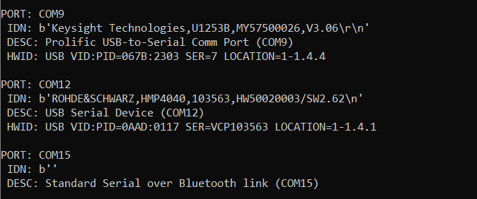

# scpi-hw-discovery:
## What is it for?
Short script to try to identify serial measurement hardware to COM port mapping present in your system. Hardware must be SCPI compliant to respond to the standard query.
## What does it do?
The script sends "*IDN?" query to all COM ports. Query is sent blindly with EOL (\r\n) termination to all COM ports. If required, the command is repeated at other, specific baud rates.
Response is printed to console listing COM ports and the identification strings received wherever successful.

Example output:



## When to use?
* If you need to run serial hardware control scripts but are unsure what COM port was assigned to which device. 
* If you, like me, find it awkward to use the device manager to try to spot a COM port appear and disappear in hope of recognizing your hardware location as you frantically plug the USB in and out while cursing. 
* Also dedicated to all those who were betrayed by the evil combo of a cleaning personnel who rewired your test tools during cleanup followed by Windows reshuffling of the port assignments.
## How to use?
You can either:
* run the script directly from prompt:
    ```
    python scpi_hw_discovery.py
    ```
   You can additionally search at 115200 baud and dump yaml file with the result:
    ```
    python scpi_hw_discovery.py dump_yml=True 9600 115200
    ```
* run from batch file (windows). 
    
    __NOTE__: you must replace the call path with your own path to the Python prompt (here anaconda))
    ```
    call C:\Users\Z40\Anaconda3\Scripts\activate.bat
    python scpi_hw_discovery.py dump_yml=True 9600
    pause
    ```
* import into your own code:
    ```python
    from scpi_hw_discovery import idn_scan
    idn_scan(dump_yml=True, baud_rates=(9600, 115200))
    ```
